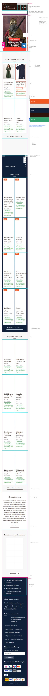

# Procesverslag
Markdown is een simpele manier om HTML te schrijven.  
Markdown cheat cheet: [Hulp bij het schrijven van Markdown](https://github.com/adam-p/markdown-here/wiki/Markdown-Cheatsheet).

Nb. De standaardstructuur en de spartaanse opmaak van de README.md zijn helemaal prima. Het gaat om de inhoud van je procesverslag. Besteedt de tijd voor pracht en praal aan je website.

Nb. Door *open* toe te voegen aan een *details* element kun je deze standaard open zetten. Fijn om dat steeds voor de relevante stuk(ken) te doen.

## Jij

  
uitwerken voor kick-off werkgroep

  ### Auteur:
  Mees Groeneveld

  #### Je startniveau:
  blauw

  #### Je focus:
  surface plane
 

## Je website

  
Ik moet een website namaken met mijn eigen kennis

  ### Je opdracht:
  (https://www.celticwebmerchant.com/nl/)

  #### Screenshot(s) van de eerste pagina (small screen): 
  hier de naam van de pagina  
  

  #### Screenshot(s) van de tweede pagina (small screen):
  hier de naam van de pagina  
  
 

## Toegankelijkheidstest 1/2 (week 1)

  
wwe moesten onze website testen op hoe goed mensen met een beperking hem konden gebruikene werkgroep 

  ### Bevindingen
  Lijst met je bevindingen die in de test naar voren kwamen:

  De website zelf had weinig goed werkende knoppen zonder de muis te gebruiken en de screenreader kwam niet verder dan de google revieuws.

## Breakdownschets (week 1)

  
uitwerken na afloop 3e werkgroep

  ### de hele pagina: 
  

  ### dynamisch deel (bijv menu): 
  

  ### wellicht nog een dynamisch deel (bijv filter): 
  

## Voortgang 1 (week 2)

  
uitwerken voor 1e voortgang

  ### Stand van zaken
  De Html is moeilijk op te stellen ik heb elementen die ik nog nooit heb gebruikt of gemaakt op mijn lijst laat staan dat ik goed weet hoe dit in en onder eklaar gezet moet worden.

  ### Agenda voor meeting
  samen met je groepje opstellen

  | student 1      | student 2          | student 3    | student 4        |
  | ---            | ---                | ---          | ---              |
  | dit bespreken  | en dit             | en ik dit    | en dan ik dat    |
  | en dat ook nog | dit als er tijd is | nog een punt | dit wil ik zeker |
  | ...            | ...                | ...          | ...              |

  ### Verslag van meeting
  hier na afloop snel de uitkomsten van de meeting vastleggen

  - punt 1
  - punt 2
  - nog een punt
  - ...

## Voortgang 2 (week 3)

  
uitwerken voor 2e voortgang

  ### Stand van zaken
  Ik heb nog veel te doen en het bijhouden van zowel css en code is moielijk gelukig heb ik nu de colapsable aan de praat gekregen.

  ### Agenda voor meeting
  samen met je groepje opstellen

  | student 1      | student 2          | student 3    | student 4        |
  | ---            | ---                | ---          | ---              |
  | dit bespreken  | en dit             | en ik dit    | en dan ik dat    |
  | en dat ook nog | dit als er tijd is | nog een punt | dit wil ik zeker |
  | ...            | ...                | ...          | ...              |

  ### Verslag van meeting
  hier na afloop snel de uitkomsten van de meeting vastleggen

  - punt 1
  - punt 2
  - nog een punt
- ...

## Toegankelijkheidstest 2/2 (week 4)

  
uitwerken na test in 9e werkgroep

  ### Bevindingen
  Mijn website heeft nog veel te veel aan te passen, niks werkt zowel screen reader als de mouseles navigatie

## Voortgang 3 (week 4)

  
uitwerken voor 3e voortgang

  ### Stand van zaken
 aaaaah ik loop te veel achter dus ik moet het gaan inhalen ik heb de basis structuur nu een soort van maar de carusel werkt niet en de website is moeilijk in elkaar te css'en ik had de html eerst voldedig moeten maken voordat ik aan mijn css ging want nu heb ik echt moeite met overzicht.

  ### Agenda voor meeting
  samen met je groepje opstellen

  | student 1      | student 2          | student 3    | student 4        |
  | ---            | ---                | ---          | ---              |
  | dit bespreken  | en dit             | en ik dit    | en dan ik dat    |
  | en dat ook nog | dit als er tijd is | nog een punt | dit wil ik zeker |
  | ...            | ...                | ...          | ...              |

  ### Verslag van meeting
  hier na afloop snel de uitkomsten van de meeting vastleggen

  - punt 1
  - punt 2
  - nog een punt
  - ...

## Eindgesprek (week 5)

  
uitwerken voor eindgesprek

  ### Je uitkomst - karakteristiek screenshots:
  

  ### Dit ging goed/Heb ik geleerd: 
  ik heb geleerd dat ik echt mijn html eerst moet maken om overzicht te houden over mijn css later want als ik het tegelijkertijd doe valt alles in de soep. 

  

  ### Dit was lastig/Is niet gelukt:
  de css werkt nog niet en hete is niet semanties correct ook heb ik maaar 1 pagina zonder extra toevoegingen, ook heb ik niet een een normale navigatie met een hmburger menu

  

## Bronnenlijst

  
continu bijhouden terwijl je werkt

  Nb. Wees specifiek ('css-tricks' als bron is bijv. niet specifiek genoeg). 
  Nb. ChatGpT en andere AI horen er ook bij.
  Nb. Vermeld de bronnen ook in je code.

  1. https://css-tricks.com/snippets/css/a-guide-to-flexbox/
  2. https://css-tricks.com/snippets/css/complete-guide-grid/#aa-introduction-to-css-grid
  3. https://developer.mozilla.org/en-US/docs/Web/CSS/flex-wrap
  4. https://codepen.io/shooft/pen/mdBOZLz
  5. https://www.shecodes.io/athena/9925-prevent-horizontal-scroll-on-smaller-devices-with-css#google_vignette 
  6. notebook van vorig coderen lessen jaar 1

